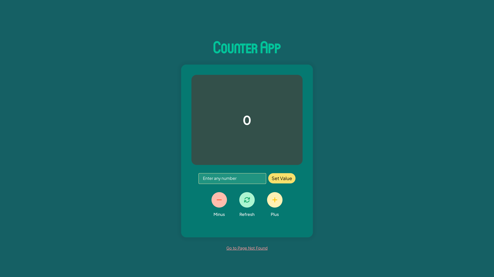

# Introduction
The Counter App is a React-based web application that provides a straightforward way to count. It includes features for setting and updating counts, a user-friendly interface, and error handling capabilities.

# Features

**Counting:** The app allows you to increase and decrease a counter with a click of a button.

**Custom Value Setting:** You can set the counter to a specific value by entering it in an input field and clicking "Set Value."

**Page Not Found:** There's a "Page Not Found" component for handling routes that do not exist.

**Error Handling:** The app uses an error boundary component to catch and display errors to the user. If an error occurs within the app, you'll see a "Something went wrong" message.

**Navigation:** You can navigate between the main counter app and the "Page Not Found" page.

**Demo**
You can access a live demo of the app at this [Counter-App] https://altschool-exam-counter-app-topaz.vercel.app/

# Styling
The app is styled using CSS with fonts imported from Google Fonts and CDN fonts. The styling is responsive and adapts to smaller screens as well.

# Contributing
Contributions to this project are welcome. If you find any issues or have ideas for improvements, please open an issue or submit a pull request.

